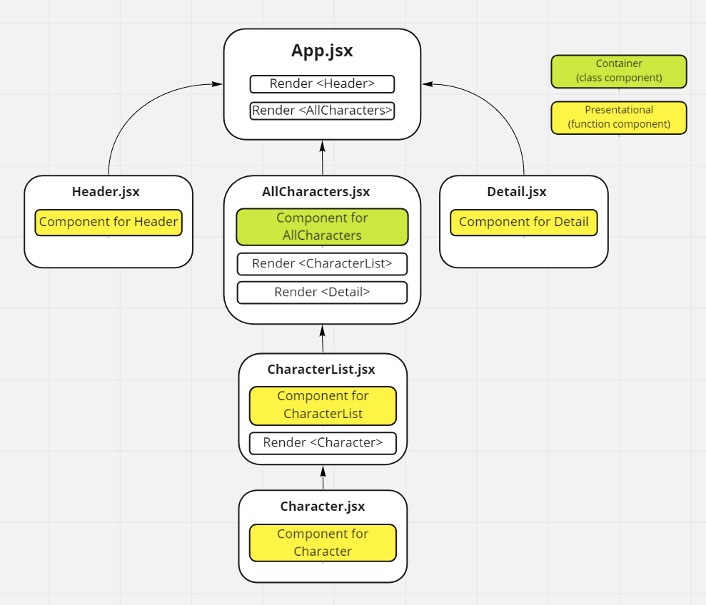

# React & the Last Airbender API `(with Hooks!)`

This repo is similar to [lab27-react](https://github.com/bryanakitchen/lab27-react), but uses Hooks to manage state and componentDidMount/componentDidUpdate. Users can view a list of characters from the [Last Airbender API](https://last-airbender-api.herokuapp.com/) and select a character to navigate to the detail page.

## Component Hierarchy

A similar component hierarchy was also implemented.

